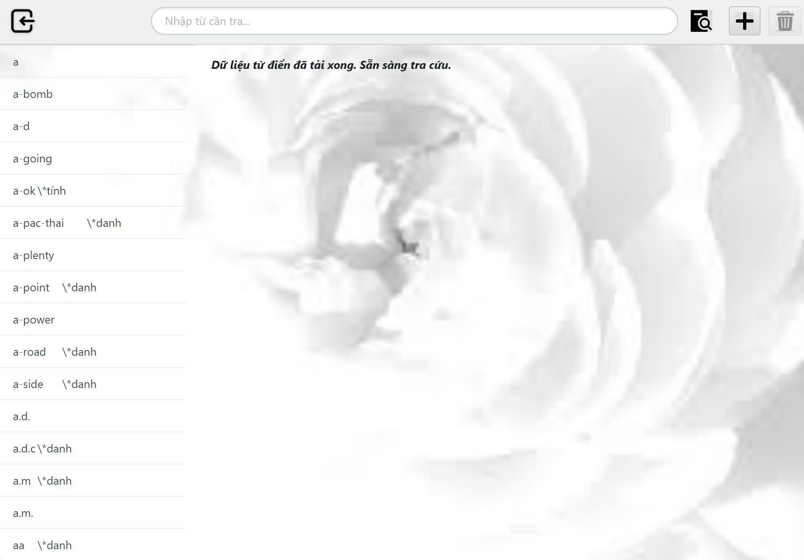
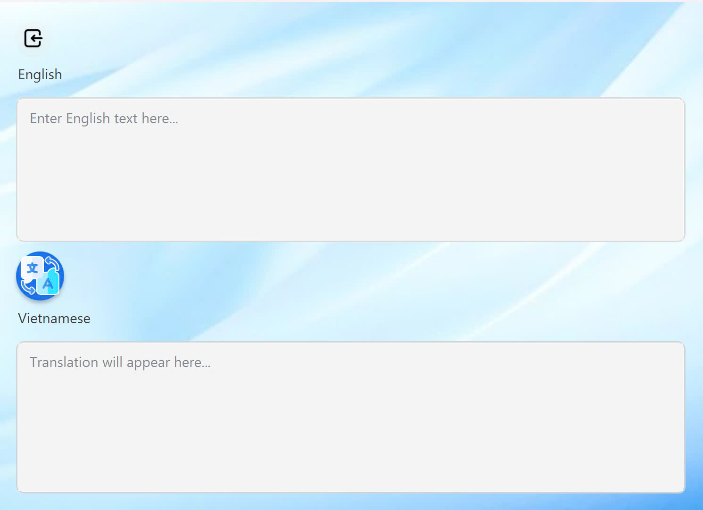
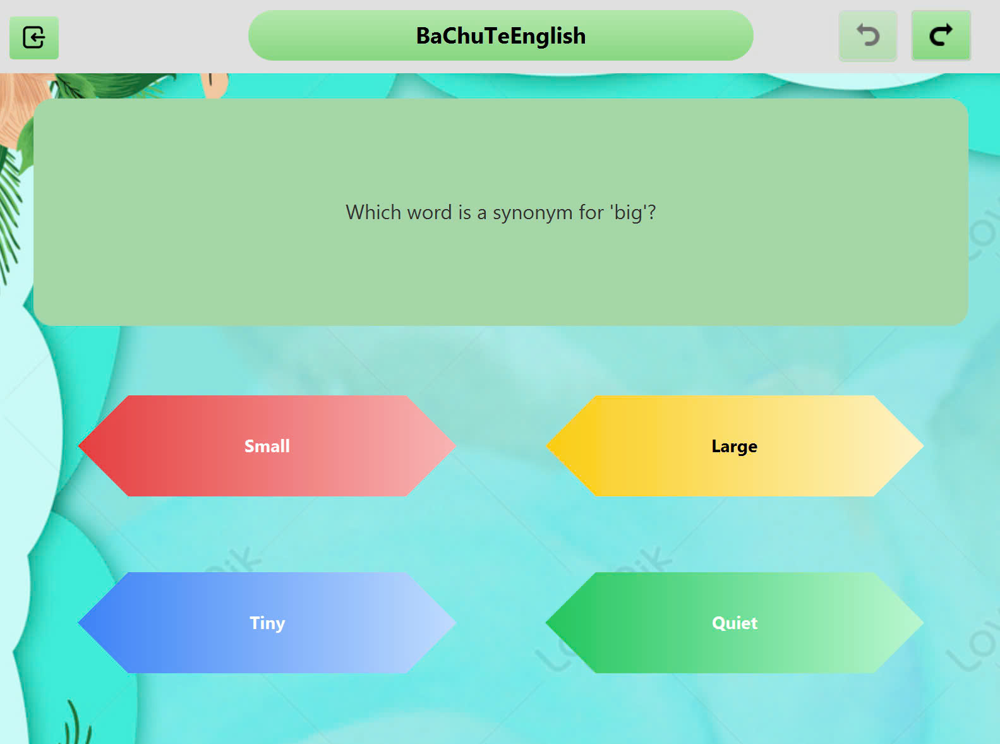

# EnglishApp

Final Project for OOP (INT2204 2)

## Team Members
- Trần Công Tuấn - 24022485
- Nguyễn Đức Trung - 24022473
- Phạm Sỹ Toàn - 24022467

# Giới thiệu
- Ứng dụng từ điển giúp cho người dùng có thể tra cứu, học từ vựng tiếng Anh một cách nhanh và hiệu quả nhất.
- Kết hợp với các trò chơi giúp người học giải trí sau những giờ học căng thẳng.
- Được viết bằng ngôn ngữ Java và hỗ trợ bởi thư viện JavaFX để tạo ra giao diện đồ hoạ thú vị, đẹp mắt.

## Table of contents
- [Chức năng](#Chức-năng)
    - [Sử dụng từ điển](#Sử-dụng-từ-điển)
    - [Dịch thuật](#Dịch-thuật)
    - [Trò chơi](#Trò-chơi)
- [Công nghệ sử dụng](#Công-nghệ-sử-dụng)
    - [JavaFX](#JavaFX)
    - [MyMemory API](#)

# Chức năng
Các tính năng mà ứng dụng sẽ hỗ trợ.
## Sử dụng từ điển
- Tra cứu từ vựng tiếng Anh: phát âm, từ loại, nghĩa, từ đồng nghĩa, trái nghĩa.
- Thêm/sửa/xóa từ vựng.
- Nghe phát âm của từ vựng.
- Thêm từ vựng vào mục yêu thích.
- Khởi tạo lại dữ liệu từ điển về ban đầu.
- 

## Dịch thuật
- Sử dụng công cụ dịch thuật của MyMemory để dịch từ vựng, câu văn.
  

## Trò chơi
- Giúp người học giải trí
- Mang tính học thuật, hỗ trợ việc học từ vựng
  
- Hai game:
    * Trắc nghiệm (Quizz)
      
    * Tìm từ (Wordle)
      
    

# Công nghệ sử dụng
Các kĩ thuật, công nghệ sử dụng để xây dựng ứng dụng.

## JavaFX
- Sử dụng JavaFX để tạo giao diện đồ hoạ cho ứng dụng.
## MyMemory API
- Sử dụng MyMemory API để dịch thuật.
